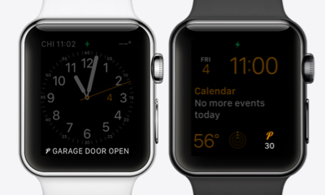

@NanotechComputers/node-red-pushover
======================
[](https://www.npmjs.com/package/@nanotechcomputers/node-red-pushover)

A [Pushover](https://www.pushover.net/) API wrapper for Node-RED.
____


## Installation
### Palette Manager
The recommended way to manage node red packages are through the [palette manager](https://nodered.org/docs/user-guide/editor/palette/manager) 
### NPM
Alternatively, you can run the following command in your Node-RED user directory - typically `~/.node-red`

```
npm i @nanotechcomputers/node-red-pushover
```

## Required Inputs
- `msg.payload`(required): The message of the notification, supports only a [few html tags](https://pushover.net/api#html)
  - HTML tags currently supported:
    - <b>bold text</b> - display word in bold
    - <i>italicised text</i> - display word in italics
    - <u>underlined text</u> - display word underlined
    - <font color="#0000ff">font colour</font> - display word in blue text
    - <a href="http://example.com/">href link</a> - display word as a link

## Optional Inputs
- `msg.topic`: This will be used as the title of the notification if **Title** is not set.
- `msg.image`: The URL of the image in the notification. Supports aLocal file path or http(s) url.
- `msg.url`: Can add an url to your notification.
- `msg.url_title`: Can set the title of the url.
- `msg.priority`: Affects how the message is presented to the user, [more details](https://pushover.net/api#priority)
  - Lowest Priority (-2)
  - Low Priority (-1)
  - Normal Priority (0)
  - High Priority (1)
- `msg.device`: Default for all devices if not provided, separated by a comma.
- `msg.sound`: Name of the notification sound, [more details](https://pushover.net/api#sounds)
  - pushover - Pushover (default)   
  - bike - Bike   
  - bugle - Bugle   
  - cashregister - Cash Register   
  - classical - Classical   
  - cosmic - Cosmic   
  - falling - Falling   
  - gamelan - Gamelan   
  - incoming - Incoming   
  - intermission - Intermission   
  - magic - Magic   
  - mechanical - Mechanical   
  - pianobar - Piano Bar   
  - siren - Siren   
  - spacealarm - Space Alarm   
  - tugboat - Tug Boat   
  - alien - Alien Alarm (long)   
  - climb - Climb (long)   
  - persistent - Persistent (long)   
  - echo - Pushover Echo (long)   
  - updown - Up Down (long)   
  - vibrate - Vibrate Only
  - none - None (silent) 
- `msg.timestamp`: An unix timestamp to specific the date time of your notification.

See <a href="https://pushover.net/api" target="_new">Pushover.net</a> for the full API reference.

## Pushover Glances


With Pushover's Glances API, you can push small bits of data directly to a constantly-updated screen, referred to as a widget, such as a complication on your smartwatch or a widget on your phone's lock screen.



### Available Inputs
- `msg.payload`: This will be used as the title if **Title** is not set
- `msg.text`: The main line
- `msg.subtext`: The second line
- `msg.count`: The number
- `msg.percent`: The progress bar/circle
- `msg.device`: Device name, default for all


Credit goes to [Ray](https://github.com/RayPS/node-red-contrib-pushover) for starting this project
